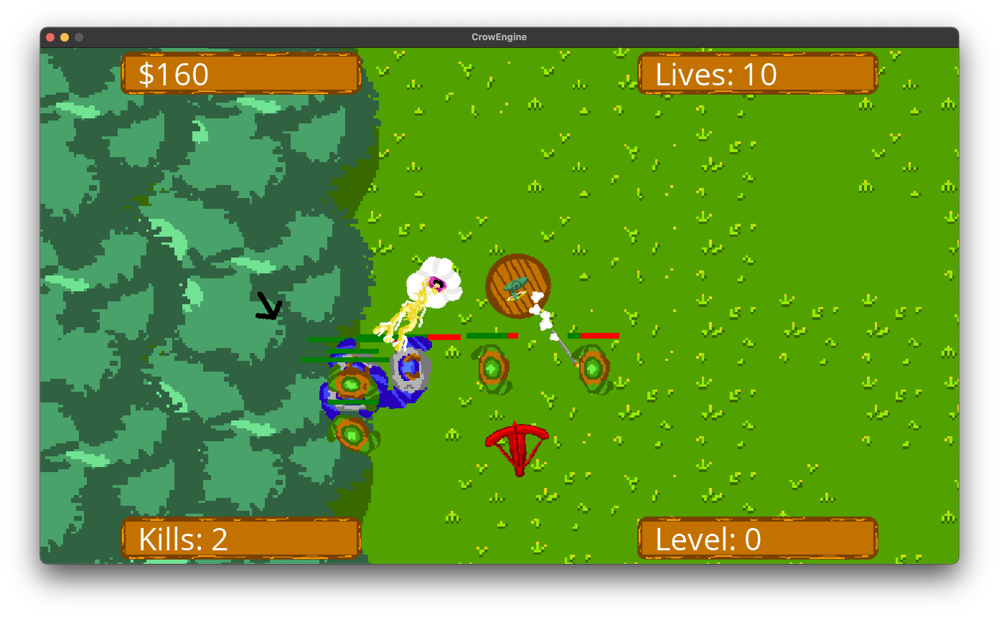

# Magic Knights (Tower Defense)

This is a game which Taylor and Ryan Anderson collaborated on to create for a class on Game Development. The game was created using Monogame, following an *mostly* ECS architecture.

## Crow Engine

The game itself is built off of the Crow Engine, a Monogame based game engine which we have also written. It was built in order to accomadate multiple kinds of games, but specifically 2D games. It isn't as extensible as other software such as Unity, but was very fun to get into the basics of physics, collisions, and drawing to write this ourselves.
